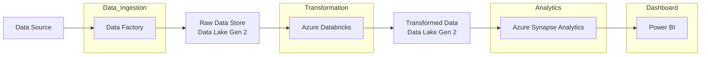

# datadot-e2e-data-pipeline

- [datadot-e2e-data-pipeline](#datadot-e2e-data-pipeline)
  - [Architecture](#architecture)
  - [TODO](#todo)

## Architecture

## TODO

* to schedule the meetings with coordinator to drive
* to create a chat with coordinator
* to identify the data set www.re3data.org?
* to split the tasks (will be used to write the essay)