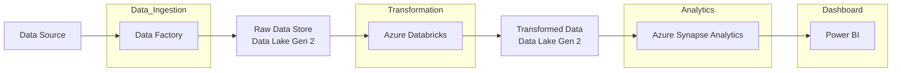

# datadot-e2e-data-pipeline

- [datadot-e2e-data-pipeline](#datadot-e2e-data-pipeline)
  - [Architecture](#architecture)
  - [Articles and Resources](#articles-and-resources)
  - [Technology Stack](#technology-stack)
  - [Data Source](#data-source)
  - [Task List](#task-list)

## Architecture

##  Articles and Resources

- [Modelling Data Pipelines](https://ieeexplore.ieee.org/document/9226314)
- [Azure End-to-End Data Engineering Project](https://medium.com/@allanouko17/azure-end-to-end-data-engineering-project-part-1-d9067ba962b0)
- [Incorporating Deep Learning Model Development With an End-to-End Data Pipeline](https://www.researchgate.net/publication/383885077_Incorporating_Deep_Learning_Model_Development_with_an_End-to-End_Data_Pipeline)
- [Azure End-To-End Data Engineering Project for Beginners](https://www.youtube.com/watch?v=ygJ11fzq_ik)

## Technology Stack

- **Azure Data Factory** - Data Ingestion
- **Azure Databricks** - Data Transformation
- **Azure Synapse Analytics** - Data Analytics
- **Power BI** - Data Visualization

## Data Source 

- [imdb-dataset](https://www.kaggle.com/datasets/ashirwadsangwan/imdb-dataset/data)

## Task List

- [ ] Data Ingestion
  - [ ] Create a storage in Azure
  - [ ] Ingest the data from source to storage
- [ ] Data Transformation
  - [ ] Prepare a local version of the pipeline to cleanup and transform the data
  - [ ] Automate the data transformation in Azure 
- [ ] Data Analytics
  - [ ] Local version of the analysis
  - [ ] Automate in Azure 
- [ ] Data Visualization
- [ ] Write the documentation
- [ ] Create a presentation
- [ ] Write the essay
