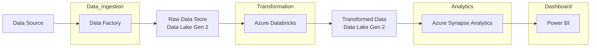

# datadot-e2e-data-pipeline

- [datadot-e2e-data-pipeline](#datadot-e2e-data-pipeline)
  - [Architecture](#architecture)

## Architecture

```mermaid
flowchart LR
    DataSource[Data Source] --> DataFactory[Data Factory]
    DataFactory --> RawDataStore[Raw Data Store<br/>Data Lake Gen 2]
    RawDataStore --> AzureDatabricks[Azure Databricks]
    AzureDatabricks --> TransformedDataStore[Transformed Data<br/>Data Lake Gen 2]
    TransformedDataStore --> AzureSynapse[Azure Synapse Analytics]
    AzureSynapse --> PowerBI[Power BI]

    subgraph Data_Ingestion
        DataFactory
    end

    subgraph Transformation
        AzureDatabricks
    end

    subgraph Analytics
        AzureSynapse
    end

    subgraph Dashboard
        PowerBI
    end
```
