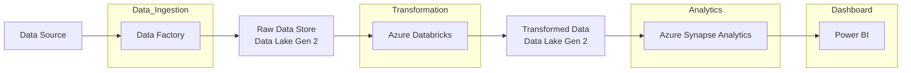
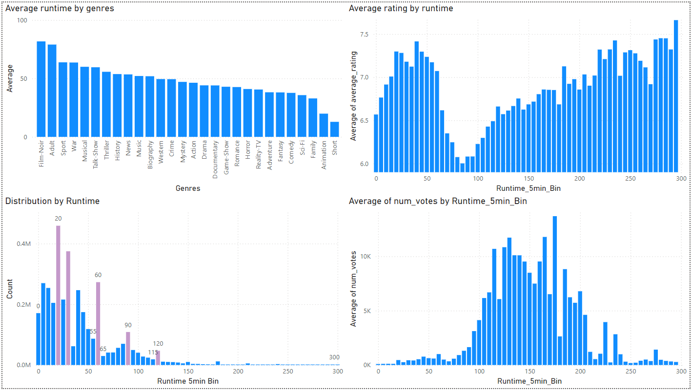
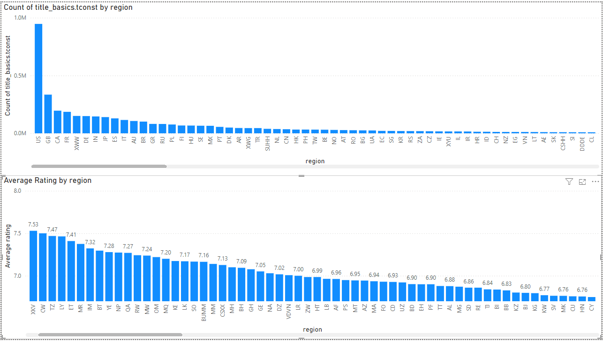

# datadot-e2e-data-pipeline

- [datadot-e2e-data-pipeline](#datadot-e2e-data-pipeline)
  - [Architecture](#architecture)
  - [Articles and Resources](#articles-and-resources)
  - [Technology Stack](#technology-stack)
  - [Data Source](#data-source)
  - [Task List](#task-list)
  - [Results](#results)

## Architecture

##  Articles and Resources

- [Modelling Data Pipelines](https://ieeexplore.ieee.org/document/9226314)
- [Azure End-to-End Data Engineering Project](https://medium.com/@allanouko17/azure-end-to-end-data-engineering-project-part-1-d9067ba962b0)
- [Incorporating Deep Learning Model Development With an End-to-End Data Pipeline](https://www.researchgate.net/publication/383885077_Incorporating_Deep_Learning_Model_Development_with_an_End-to-End_Data_Pipeline)
- [Azure End-To-End Data Engineering Project for Beginners](https://www.youtube.com/watch?v=ygJ11fzq_ik)

## Technology Stack

- **Azure Data Factory** - Data Ingestion
- **Azure Databricks** - Data Transformation
- **Azure Synapse Analytics** - Data Analytics
- **Power BI** - Data Visualization

## Data Source 

- [imdb-dataset](https://www.kaggle.com/datasets/ashirwadsangwan/imdb-dataset/data)

## Task List

- [x] Data Ingestion
  - [x] Create a storage in Azure
  - [x] Ingest the data from source to storage
- [x] Data Transformation
  - [x] Prepare a local version of the pipeline to cleanup and transform the data
  - [x] Automate the data transformation in Azure 
- [x] Data Analytics
  - [x] Local version of the analysis
  - [x] Automate in Azure 
- [x] Data Visualization
- [ ] Write the documentation
- [ ] Create a presentation
- [ ] Write the essay

## Results

| Analysis Aspect                              | Details                                                                                                            |
| -------------------------------------------- | ------------------------------------------------------------------------------------------------------------------ |
| Best rated genres                            | History, Documentary, Biography, Animation                                                                         |
| Distribution of movies based on the year     | Peak in 2021 (501k movies)                                                                                         |
| Most popular genres                          | Drama, Comedy, Talk-Show                                                                                           |
| Rating distribution                          | Gaussian distribution with a mean of 7.4                                                                           |
| Runtime average based on the genre           | Film-Noir (82 mins), Adult (79 mins), Sport (63 mins)                                                              |
| Average rating based on the runtime          | Peak at 40 minutes (7.41 rating) which goes down to 6 at 85 minutes and gradually increases to 7.45 at 285 minutes |
| Distribution of movies based on the runtime  | Peak at 20 minutes (450k movies), 30 minutes (374k movies), 60 (273k movies)                                       |
| Average number of votes based on the runtime | Bell-shaped curve centered around 90-200 minutes. Peak at 170 minutes (13k votes)                                  |
| Count of movies based on the region          | Peak in the US (946k movies), GB (118k movies), IN (334k movies), CA (194k movies), FR (185k movies)               |
| Average rating based on the region           | UG (7.78), MV (7.66), TN (7.59)                                                                                    |

Summary of the movies dataset:

Overview of the movies based on the runtime:

Report based on the movies region:

