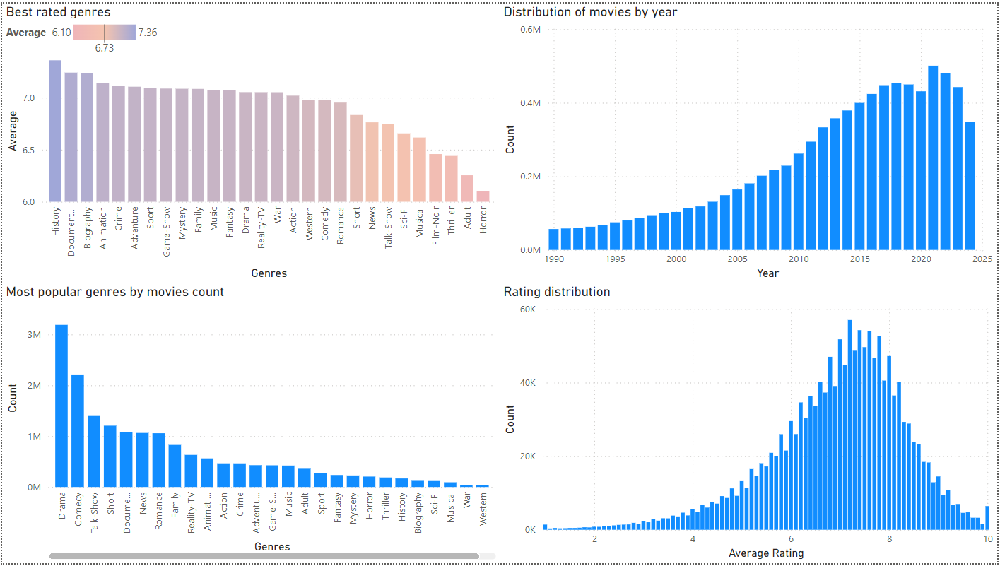

# datadot-e2e-data-pipeline

- [datadot-e2e-data-pipeline](#datadot-e2e-data-pipeline)
  - [Team Members](#team-members)
  - [Problem Statement](#problem-statement)
  - [Architecture](#architecture)
  - [Articles and Resources](#articles-and-resources)
  - [Data Source](#data-source)
  - [Task List](#task-list)
  - [Results](#results)
  - [What we have learned](#what-we-have-learned)

## Team Members

- Eugen-Cristian RAVARIU
- Vladislav TIFTILOV

## Problem Statement

Movies are a popular form of entertainment and are watched by millions of people around the world. The dataset contains information about movies, including the title, genre, rating, runtime, and the number of votes. The goal of this project is to analyze the dataset and provide insights into the distribution of movies based on the genre, rating, runtime, and region. The analysis will help us understand the trends in the movie industry and identify the most popular genres, regions, and runtime. The insights will be visualized using Power BI to create a dashboard that can be used to explore the data and gain a deeper understanding of the movie industry.

The main challenges of the project is caused by the size of the dataset and the need to automate the data transformation process. The dataset contains over 8GB of data and is stored in multiple CSV files. The data transformation process involves cleaning the data, aggregating the information, and performing statistical analysis to generate insights. The data pipeline will be implemented using Azure Data Factory, Azure Databricks, Azure Synapse Analytics, and Power BI to automate the data transformation process and create a dashboard for visualization.

## Architecture

The data pipeline consists of the following components:

- **Azure Data Factory** - Data Ingestion
- **Azure Databricks** - Data Transformation
- **Azure Synapse Analytics** - Data Analytics
- **Power BI** - Data Visualization

##  Articles and Resources

- [Modelling Data Pipelines](https://ieeexplore.ieee.org/document/9226314)
- [Azure End-to-End Data Engineering Project](https://medium.com/@allanouko17/azure-end-to-end-data-engineering-project-part-1-d9067ba962b0)
- [Incorporating Deep Learning Model Development With an End-to-End Data Pipeline](https://www.researchgate.net/publication/383885077_Incorporating_Deep_Learning_Model_Development_with_an_End-to-End_Data_Pipeline)
- [Azure End-To-End Data Engineering Project for Beginners](https://www.youtube.com/watch?v=ygJ11fzq_ik)

## Data Source 

- [imdb-dataset](https://www.kaggle.com/datasets/ashirwadsangwan/imdb-dataset/data)

## Task List

- [x] Data Ingestion (Eugen)
  - [x] Create a storage in Azure (Eugen)
  - [x] Ingest the data from source to storage (Eugen)
- [x] Data Transformation (Eugen)
  - [x] Prepare a local version of the pipeline to cleanup and transform the data (Eugen)
  - [x] Automate the data transformation in Azure  (Eugen)
- [x] Data Analytics (Vlad)
  - [x] Transform data (Vlad) 
- [x] Data Visualization - Powerbi
  - [x] Create a PowerBI dashboard (Vlad)
  - [x] Publish the dashboard (Vlad)
- [ ] Write the documentation (Eugen & Vlad)
- [ ] Create a presentation (Eugen & Vlad)
- [ ] Write the essay (Eugen & Vlad)

## Results

| Analysis Aspect                              | Details                                                                                                            |
| -------------------------------------------- | ------------------------------------------------------------------------------------------------------------------ |
| Best rated genres                            | History, Documentary, Biography, Animation                                                                         |
| Distribution of movies based on the year     | Peak in 2021 (501k movies)                                                                                         |
| Most popular genres                          | Drama, Comedy, Talk-Show                                                                                           |
| Rating distribution                          | Gaussian distribution with a mean of 7.4                                                                           |
| Runtime average based on the genre           | Film-Noir (82 mins), Adult (79 mins), Sport (63 mins)                                                              |
| Average rating based on the runtime          | Peak at 40 minutes (7.41 rating) which goes down to 6 at 85 minutes and gradually increases to 7.45 at 285 minutes |
| Distribution of movies based on the runtime  | Peak at 20 minutes (450k movies), 30 minutes (374k movies), 60 (273k movies)                                       |
| Average number of votes based on the runtime | Bell-shaped curve centered around 90-200 minutes. Peak at 170 minutes (13k votes)                                  |
| Count of movies based on the region          | Peak in the US (946k movies), GB (118k movies), IN (334k movies), CA (194k movies), FR (185k movies)               |
| Average rating based on the region           | UG (7.78), MV (7.66), TN (7.59)                                                                                    |

Summary of the movies dataset:

Overview of the movies based on the runtime:

Report based on the movies region:

## What we have learned

- How to create an end-to-end data pipeline using Azure services
- How to ingest data from a source to a storage in Azure
- Data transformation is a complex process that involves cleaning, aggregating, and analyzing the data
- Data transformation requires multiple steps (raw to bronze, bronze to silver, silver to gold)
- Data visualization is an important aspect of data analysis
- Data visualization requires understanding the data and selecting the relevant metrics
- Dataset size and complexity can impact the performance of the data pipeline
- Dataset may require other data sources to enrich the data
