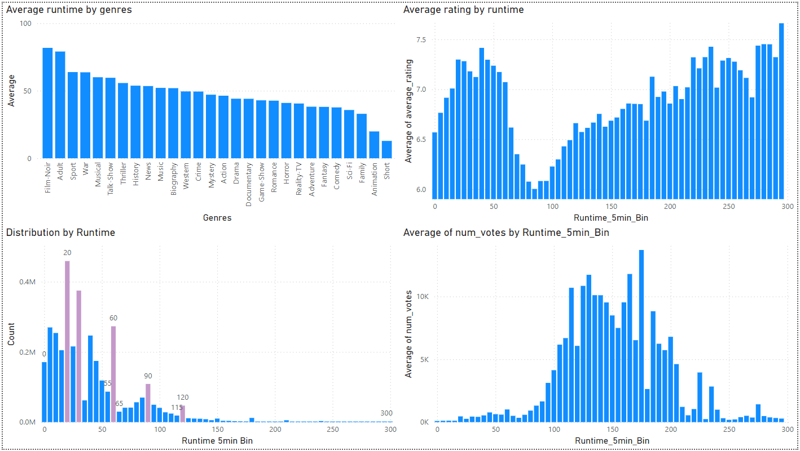

<!-- _class: lead -->
# datadot-e2e-data-pipeline

**An end-to-end data engineering project using Azure Data Factory, Databricks, Synapse, and Power BI.**

---

## Table of Contents

1. Architecture  
2. Articles and Resources  
3. Data Source  
4. Problem Statement  
5. Task List  
6. Results  
7. What We Have Learned  

---

## Architecture

The data pipeline consists of the following components:

- **Azure Data Factory** (Data Ingestion)  
- **Azure Databricks** (Data Transformation)  
- **Azure Synapse Analytics** (Data Analytics)  
- **Power BI** (Data Visualization)

---

---

## Data Source

- [imdb-dataset (Kaggle)](https://www.kaggle.com/datasets/ashirwadsangwan/imdb-dataset/data)

This dataset contains over 8GB of data stored in multiple CSV files, with movie-related attributes such as title, genre, rating, runtime, and number of votes.

---

## Problem Statement

Movies are watched by millions worldwide, and analyzing their data can reveal trends and insights about the industry:

- **Goal**:  
  - To analyze and provide insights into the distribution of movies by genre, rating, runtime, and region.  
  - To visualize the results in a Power BI dashboard for deeper understanding.

---

## Challenges

- Large dataset (~8GB).  
- Need for automated data transformation (cleaning, aggregation, statistics).  
- Leveraging Azure Data Factory, Azure Databricks, Azure Synapse Analytics, and Power BI for an end-to-end pipeline.

---

## Results

| Analysis Aspect                   | Details                                               |
| --------------------------------- | ----------------------------------------------------- |
| **Best rated genres**             | History, Documentary, Biography, Animation            |
| **Distribution of movies (year)** | Peak in 2021 (501k movies)                            |
| **Most popular genres**           | Drama, Comedy, Talk-Show                              |
| **Rating distribution**           | Gaussian distribution with mean ~7.4                  |
| **Runtime average by genre**      | Film-Noir (82 mins), Adult (79 mins), Sport (63 mins) |

---

## Results

| Analysis Aspect               | Details                                                                                  |
| ----------------------------- | ---------------------------------------------------------------------------------------- |
| **Average rating by runtime** | Peak at 40 mins (7.41), dips to ~6 at 85 mins, then gradually rises to ~7.45 at 285 mins |
| **Distribution by runtime**   | Peaks at 20 mins (450k movies), 30 mins (374k), 60 mins (273k)                           |
| **Average votes by runtime**  | Bell-shaped curve centered ~90–200 mins, peak at 170 mins (13k votes)                    |
| **Count of movies by region** | US (946k), GB (118k), IN (334k), CA (194k), FR (185k)                                    |
---

---

--- 

---

## What We Have Learned

- **Building an E2E pipeline in Azure**: Data Factory for ingestion, Databricks for transformation, Synapse for analytics, Power BI for visualization.  
- **Data transformation complexity**: Multiple steps (raw → bronze → silver → gold).  

---

## What We Have Learned

- **Visualization approach**: Selecting relevant metrics and understanding data distribution is crucial.  
- **Performance considerations**: Large dataset (~8GB), multiple CSVs, and parallel processing.  
- **Potential data enrichment**: Other datasets (e.g., economic or social factors) could add more context to movie data.

---

## Articles and Resources

- [Modelling Data Pipelines](https://ieeexplore.ieee.org/document/9226314)  
- [Azure End-to-End Data Engineering Project (Medium)](https://medium.com/@allanouko17/azure-end-to-end-data-engineering-project-part-1-d9067ba962b0)  
- [Incorporating Deep Learning Model Development With an End-to-End Data Pipeline](https://www.researchgate.net/publication/383885077_Incorporating_Deep_Learning_Model_Development_with_an_End-to-End_Data_Pipeline)  
- [Azure End-To-End Data Engineering Project for Beginners (YouTube)](https://www.youtube.com/watch?v=ygJ11fzq_ik)
